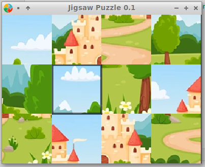

# About
Puzzle game implemented in Go and SDL2. 

# Controls

Only keyboard

| Desktop    | PocketGo2v2 | Function             |
|------------|-------------|----------------------|
| Home Key   | Menu        | menu on/off          |
| Left Ctrl  | A           | hold to drag         |
| Arrow Keys | ←,↑,→,↓     | move selection frame |  

# How To Play

Move tiles around to get the big picture.
